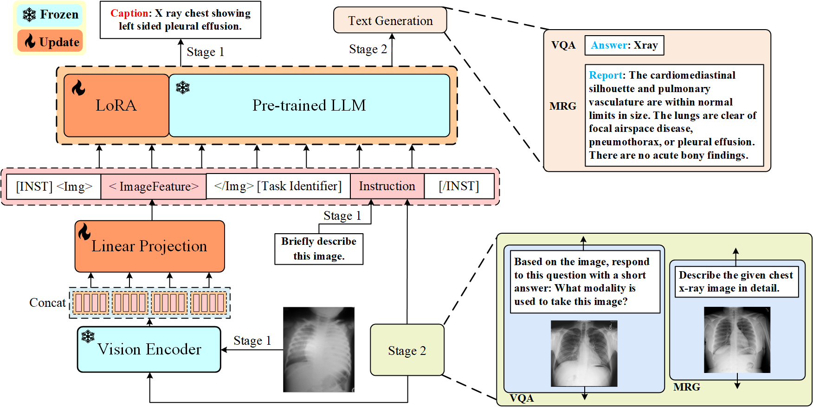

# PeFoMed
This is the official implementation of [PeFoMed: Parameter Efficient Fine-tuning of Multimodal Large Language Models for Medical Imaging](https://arxiv.org/abs/2401.02797).

<div align=center>

</div>
<center>Figure 1: Overview of the PeFoMed. </center>

## Datasets
The configuration of all datasets needs to be set in the corresponding dataset configuration file in the **pefomed/configs/datasets/medical**

Stage 1 finetune datasets: [ROCO](https://link.springer.com/chapter/10.1007/978-3-030-01364-6_20), [CLEF2022](https://ceur-ws.org/Vol-3180/paper-95.pdf), [MEDICAT](https://arxiv.org/abs/2010.06000), and [MIMIC-CXR](https://arxiv.org/abs/1901.07042)

Stage 2 finetune medical VQA datasets: [VQA-RAD](https://www.nature.com/articles/sdata2018251#data-citations), [PathVQA](https://arxiv.org/abs/2003.10286) and [Slake](https://arxiv.org/abs/2102.09542).

Stage 2 finetune MRG dataset: [IU-Xray](https://pubmed.ncbi.nlm.nih.gov/26133894/)

## Acknowledgement
If you're using PeFoMed in your research or applications, please cite using this BibTeX:
```bibtex
@misc{liu2024pefomedparameterefficientfinetuning,
      title={PeFoMed: Parameter Efficient Fine-tuning of Multimodal Large Language Models for Medical Imaging}, 
      author={Gang Liu and Jinlong He and Pengfei Li and Genrong He and Zhaolin Chen and Shenjun Zhong},
      year={2024},
      eprint={2401.02797},
      archivePrefix={arXiv},
      primaryClass={cs.CL},
      url={https://arxiv.org/abs/2401.02797}, 
}
```
## License
This repository is under [BSD 3-Clause License](LICENSE.md).

Many codes are based on [Lavis](https://github.com/salesforce/LAVIS) and [MiniGPT-v2](https://github.com/Vision-CAIR/MiniGPT-4)
